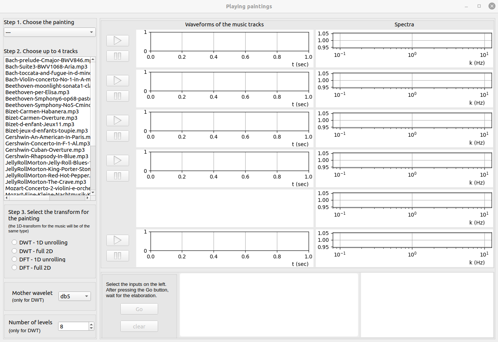

# Playing paintings

**<kbd>PlayingPaintings</kbd>** is a Python app for analysing similarities
between a digital image and a set of music pieces. For this purporse, the least square approach described in [this](https://doi.org/10.48550/arXiv.2206.14142)
reference has been applied.  
For copyright reasons, **the digital images (.png) and the music tracks (.mp3
or .wav) needed to run the app must by provided by you.**

# Getting started

- [Download and install](#download)
- [The data](#data)
- [Run the app](#run)
- [Generated files](#newfiles)
- [Warnings](#warnings)

# Download and install

- Clone the github repository or download the zip file and uncompress it.
- Install the following Python packages:

  pathlib  
  numpy  
  scipy  
  PyWavelets  
  librosa  
  soundfile  
  Pillow  
  PySide2  
  matplot  
  
  `pip install pathlib numpy scipy PyWavelets librosa soundfile Pillow PySide2 matplot`

# The data

To run the app, a set of audio tracks (mp3 or wav) and a set of digital images (png) must be available in your storage space (not necessarily in the same directory where the app is located).  Audio tracks can have different samplerates.  

- Modify the value of
the variables *music_dir* and *paintings_dir* at the lines 1241--1248 of the
PlayingPaintings.py script:

   - *music_dir* must contain the (absolute) path of the directory where
     your music tracks are located,

   - *paintings_dir* must contain the (absolute or relative) path of the
     directory where your digital images are located.

- Modify the content of the files *musictracks.csv* and *paintings.csv* that you find in the same directory of the PlayingPaintings.py script.

   - The file *musictracks.csv* must contain the list of the .mp3 (or .wav) files of the music tracks to be considered for the analysis. The filenames must be complete, with their extensions. The files you list in musictracks.csv must be located in the directory *music_dir*.
   - The file *paintings.csv* must contain the list of the .png files (without extension) of the paintings to be considered for the analysis. The files you list in paintings.csv must be located in the directory *paintings_dir*. The first line of the file *paintings.csv* must not contain a filename, but any string you like.  

#  Run the app

When the app starts, a graphical window (1300x800 px) opens:

1. Select the input in the left column of the panel:

  - Step 1: select the painting from your list
  - Step 2: select up to 4 musical pieces from your list
  - Step 3: select the transform for the painting and the music tracks. If you select DWT (Discrete Wavelet Transform), then you can choose the mother wavelet and the number of levels for the transform.

2.  Click on the *Go* button and wait for the graphical output:

3. Listen to the music, in particular the *new piece of music* provided by the algorithm

4. Click on the *clear* button to clear the graphical output

5. If you want, return to 1. The *Go* button will activate when you change
at least one input.

#  Generated files

The directory *./_small* will be created by the app to store small (256x256)
reproductions of your images to display in the app panel. The original images
will be used by the numerical algorithm to perform the analysis and provide the
new piece of music.

The new piece of music is saved in the file *sound1.wav*.

# Warnings

The size of your files is free, however, bear in mind that the larger the files, the longer the time to read them, the heavier the computation, and the longer the waiting time to see the results.  

If the music tracks are too short compared with the size of the image, i.e., if
the number of samples of the music track is smaller than the number of pixels of the image, then the music track will be padded by replicating the data.

# Referencing

If you write a paper using results obtained with the help of **<kbd>PlayingPaintings</kbd>**,
please cite [this](https://doi.org/10.48550/arXiv.2206.14142) reference:

P. Gervasio, A. Quarteroni, D. Cassani. 
<i>Let do paintings play.</i>  (2022)
https://doi.org/10.48550/arXiv.2206.14142
